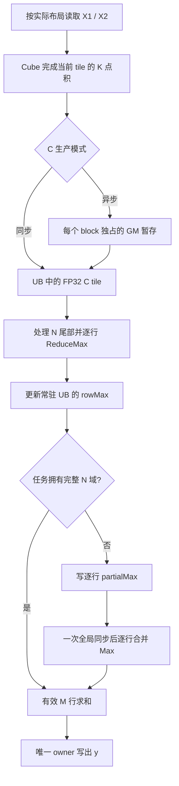

# BatchMatmulMaxSum 新设计

日期：2026-09-21。交付范围：架构、接口落地约束与验证方案，不修改或提交算子实现。

本文先仅根据 `problem_official.md`、`cann_api_reference.md` 形成独立设计并落盘，然后阅读 `plan.md`、`memory.md`、`kernel.asc`、测试和工程文件，最后整合。历史实验用于修正假设，不作为不可改变的架构约束。下文分别标明数学结论、历史观测、设计候选和待验证接口，未把设计推演写成 NPU 实测结果。

## 1. 推荐方案与主要变化

推荐采用 **单次 MIX kernel、完整点积后流式 MaxSim、分层任务归属、同步/异步双生产模式**。

基础数据流是：完成 K 累加的 C tile → FP32 行最大值 → 跨 N 更新 → 最后沿 M 求和。尽量让每个任务拥有完整的 N 域；当 batch 和 M 提供的并行度不足时，允许 N 分区；只有 M、N 都很小而 K 很大时才考虑跨核 Split-K。

需要分开决定四件事：

| 层次 | 决策 | 不能混淆的概念 |
|---|---|---|
| 物理执行 | 本次启动多少 block | 逻辑任务可以多于物理 block |
| 任务归属 | 整 batch、M 条带或 M×N 分区 | 拆 N 不等于每个 N tile 都交给不同核 |
| MatMul 调用 | 一次覆盖多少连续 N tile | 一次调用大小不必等于任务拥有的 N 范围 |
| 输出通路 | 同步取 UB，或异步经 GM 工作区取 UB | 异步不等于 C 始终留在片上 |

相对现有实现，最值得优先验证的是 **连续段长度、核间分组、输出通路的联合选择**，以及 **小输出、大 K 场景的并行度补足**。再次全局加深队列、扩大 GEMV 门槛、优化很小的最终求和，都不是默认主线。

## 2. 不可改变的语义与数学依据

```text
A[b,m,n] = sum_k X1[b,m,k] * X2[b,k,n]
R[b,m]   = max_n A[b,m,n]
y[b]     = sum_m R[b,m]
```

- B 一一配对；两种输入 dtype、四种 storage layout 均支持。
- K 点积、Max、Sum 均以 FP32 或等效精度完成，输出 `[B]` FP32。
- 全负相似度必须返回负值。内部 Max 初值用 `-inf` 或首个有效值。
- 单次运行恰好一次 global kernel launch，这是接口说明和历史评测共同给出的工程约束。
- 结果必须可重复。任务归属与加法合并顺序固定，不使用调度顺序决定的浮点 AtomicAdd。

**N 可以分区，是因为逐行 Max 可结合；M 可以分区，是因为每行 Max 完成后可对行和分区。**

设 `Np` 是 N 的不交叠分区：

```text
r_p[m] = max_(n in Np) A[m,n]
y = sum_m max_p r_p[m]
```

N 分区产物必须是行向量，不能先压成标量。例如两个分区给出的行最大值分别为 `[10,0]` 和 `[0,10]`，正确输出为 20，而先求和再取 Max 得到 10。

**K 分区必须先做逐元素加法，再做任何 Max。** 例如两段 K 对两个 document 的贡献分别为 `[10,0]`、`[-10,9]`，完整点积是 `[0,9]`，正确 Max 为 9；对各段先 Max 再相加得到 19。

流式算法减少中间态和访存，通用精确计算仍需完成全部有效点积，计算量约 `F=2BMNK`。不依赖归一化推测答案、不剪枝跳过可能成为最大值的 document。

## 3. 数据流与执行模式



图中 M 并行路径还需在 I 后写部分和，并经过一次全局同步再由 owner 汇总；整 batch 独占路径直接输出，无跨核同步。Split-K 为后述独立候选，不套用图中的提前 Max。

### 3.1 模式 A：整 batch 独占

一个 block 负责一个或多个完整 batch，逐个 M tile 扫过完整 N，直接生成该 batch 的 y。

- 无 partial GM 交换、无 `SyncAll`。
- 每次只保留当前 M tile 的 `rowMax`，不要求整个 M 驻留 UB。
- 若 `B >= C`，batch 通常已经提供充分并行度；若 B 较小且单 batch 很轻，也可能因省去同步而获胜。
- B<C 不自动否定本模式，必须比较剩余计算时间和拆分额外成本。

### 3.2 模式 B：M 条带并行，默认通用主路径

首版令一个任务拥有一个 M tile 和完整 N：`task=(b,mt)`。任务完成后写一个 FP32 `partialSum[b,mt]`。

所有 block 生产完毕后统一同步，由 batch owner 按固定顺序合并该 batch 的部分和。每个 batch 只有一个 y 写者。

M 并行的优势是核间只交换标量；代价是不同 M 任务可能重复搬入 X2。不能无限缩小 Mc 追求任务数。候选 Mc 必须同时评估 Cube 有效计算比例、重复 B 搬运与调用次数。

### 3.3 模式 C：M×N 分区并行

令 `TM=ceil(M/Mc)`、`TN=ceil(N/Nc)`、N 分区数为 P，任务为 `(b,mt,p)`。按照 tile 索引划分连续区间：

```text
first[p] = floor(p * TN / P)
end[p]   = floor((p+1) * TN / P)
0 <= p < P <= TN
```

区间互不重叠且完整覆盖 N；任务在 UB 合并区间内所有 tile，只写一次 `partialMax[b,mt,p,:]`。barrier 后 owner 先跨 p 做逐行 Max，再求行和。

即使采用单 N tile 同步调用，也可以保持连续任务区间。历史 K-tail 路径使用交错 tile 分配是实现选择，不是数学要求；迁移到连续分配时需重新验证地址和覆盖性。

候选 P 至少包含 1，以及以下值中去重后的合法整数：

```text
floor(C / (B*TM))、ceil(C / (B*TM))、2 的邻近幂
```

全部夹到 `[1,TN]`，并删去无意义的大 P。独立设计中的 `ceil(C/Qm)` 只是候选中心，不是最终公式。P 太大增加 X1 重载、partial 和短调用；P 太小闲置核。不能强制每组至少两个 tile，也不能强制用满每个核。

### 3.4 统一的物理执行协议

Host 决定一个整次 launch 一致的模式。混合核的 `GetBlockIdx/GetBlockNum`、可用 AIC/AIV 数量关系按实际平台与模板确认，不把硬件线程数直接当同步参与者数。

```text
Crun = min(平台允许且可安全同步的 block 数, 逻辑任务数)

for job = blockIdx; job < jobCount; job += Crun:
    计算并写出该 job 的独占产物
完成 MatMul 和本核相关写回
保证 GM 发布完成后，所有 Crun 个 block 参与同一次 SyncAll

for b = blockIdx; b < B; b += Crun:
    按固定规则合并本 batch 的产物
    写 y[b]
```

owner 使用循环，避免 B 大于 Crun 时漏写。不能在 barrier 前让无任务 block 提前 return，也不能启动超额、需等待排队 block 的自旋式全局屏障。`Matmul.End()`、队列释放或 `PIPE_V` 都不能单独当作 GM 写回完成的证明；必须核对 MTE3 完成与 `SyncAll<true>` 的内存可见性契约。

模式 A 不走这段同步协议，模式 B/C 正常只需一次全局同步。首版不加入复杂的跨核锁、工作窃取或两级 merge。

## 4. 真正需要重新设计的部分：C 生产方式

### 4.1 同步输出路径

`Iterate<true>` 与 `GetTensorC<true>` 成对，C 到 UB 后立即归约。目标是避免显式的异步 C GM 暂存；实际硬件搬运仍需 profiler 确认。

一次 `SetTensor/SetSingleShape` 可以覆盖连续多个 N tile，然后同步迭代消费，**同步不意味着每个 tile 都重新设置整个 MatMul**。这提供了位于“每 tile 重启”和“整段异步”之间的第三个比较基准。

适合候选：K 较小、C 字节相对计算量较大、单段 tile 少，或异步接口不支持的布局/尾块。

### 4.2 异步输出路径

一次 `Iterate<false>` 发起一段计算，再按规定顺序调用 `GetTensorC<false>` 消费。官方 CANN 9.0 说明该模式把计算结果缓存到临时工作区，再取出 C tile；`SetWorkspace` 提供的是 GM 空间。因此不能宣称其消除了所有相似度 GM 流量。[GetTensorC](https://www.hiascend.com/doc_center/source/en/CANNCommunityEdition/900/API/ascendcopapi/atlasascendc_api_07_0639.html)、[SetWorkspace](https://www.hiascend.com/doc_center/source/en/CANNCommunityEdition/900/API/ascendcopapi/atlasascendc_api_07_0654.html)。

保留异步路径，因为历史有明确收益。但其收益应解释为减少同步等待、改善流水或数据复用，而非默认消除 C 写回。

忽略 padding，每个 FP32 C 元素缓存一次并取回一次，逻辑流量约 `8BMN` bytes；相对于 `2BMNK` FLOP，其比值约为 `K/4 FLOP/byte`。例如 K=32 时为 8，K=8192 时为 2048。这是数据通路的估算，不是实际 HBM 流量，缓存命中、库实现和尾块会改变实测结果。

### 4.3 N 调用段长度与 N 分区数分离

引入 `Gcall`：一次 MatMul 调用包含的 N tile 数。任务拥有一个 N 分区，可以用多次调用覆盖：

```text
rowMax = -inf
for segment in task.N_range, each at most Gcall tiles:
    一次配置该 segment
    同步迭代，或一次异步生产后逐 tile 消费
    对每个 C tile 更新同一份 rowMax
输出一次任务产物
```

候选为 `1、2、4、8、完整分区`，先取少量能区分假设的值，而不是在线遍历笛卡尔积。

- 增大 Gcall：减少设置/消息次数，可能提高 A 复用，但增加异步驻留空间。
- 减小 Gcall：限制工作区峰值、缩短生产和消费间距，但增加调用开销。
- 改 Gcall 不必改变 P、block 数或最终 partial 布局，便于单变量验证。
- **工作区峰值下降不意味着累计 GM 流量下降**；若每个 C 元素仍缓存一次，累计读写基本不变。

这是优先级最高的新实验轴：固定 tile 与任务划分，对比“整段同步消费”“整段异步消费”“有界段异步消费”。

### 4.4 双缓冲的正确位置

第一版采用一个 C 消费槽。只有时间线表明 C 搬入/Vector 消费串行等待、且 UB 预算允许，才改为两个槽。槽生命周期必须是：

```text
空闲 -> Cube/搬运生产中 -> 可读 -> Vector 归约中 -> 可复用
```

`isReuseSource=true` 的 ReduceMax 可能修改 C 源缓冲，因此既不能提前给生产者复用，也不能同时让另一消费者读。源可复用不代表 dst 可以与 src 任意重叠。

若高阶同步路径的消息开销成为确定瓶颈、异步路径又受 C 流量限制，再考虑手工管理 CO1 与受支持的输出通路。官方存在用户管理 CO1 的 Iterate 接口，但这意味着更换 C 类型、内存与搬运协议，不能当作替换一个模板参数的优化。[Iterate](https://www.hiascend.com/doc_center/source/en/CANNCommunityEdition/900/API/ascendcopapi/atlasascendc_api_07_0638.html)。该方向不进入首版。

## 5. Tile、资源与代价模型

### 5.1 少量候选，全部接受实际 tiler 校验

普通矩阵候选覆盖 `Mc∈{16,32,64,128}`、`Nc∈{32,64,128,256}` 中的少数组合；N 极小时加入 Nc=16。保留当前通过历史评测的 tiling family 作为比较组，不把这些集合全部组合成提交试验。

优先考虑：小 Mc 增加 M 任务，大 Nc 降低 N 循环次数，较大 Mc 提高 X2 复用。Mc×Nc 同时影响 C、尾块和归约资源。小 M 的 GEMV 是独立 family，不能按普通矩阵的 padding 计算量直接评估。

Host 的 `SetFixSplit` 是请求。**必须读回 GetBaseM/GetBaseN，并重新推导 TM、TN、任务数、C 行距、所有 buffer 大小及路由**。若实际 tiling 不满足当前 family 的不变量，应换合法候选，不能覆盖 tiling 字段强行启动。

K 分块优先交给 MatMul；调整 baseK、stepK、深度或 preload 时，Host 配置和 device 模板必须匹配。不能从 `dav-2201` 编译目标推定评测设备的全部资源常量。

### 5.2 UB 预算

令 d 为 C 消费槽数，t 表示是否需要一份完整 padded C scratch：

```text
UB_peak >= 4*(d+t)*Mc*Nc
           + rowMax + tileMax + partial_IO + final_output
           + ReduceMax_tmp + ReduceSum_tmp + sync_local
           + MatMul/框架其他实际占用
```

各项按字节和实际对齐计算。同步模式不初始化异步专用空间；无尾路径若有严格路由证明，可不分配完整 tail scratch。不同阶段复用空间需要生命周期证明，不能因为“代码先后出现”就认为设备异步访问已经结束。

例如 128×128 FP32 C 为 64 KiB，两槽加一份等大尾块就是 192 KiB，尚未计算其他占用；32×128 单槽只有 16 KiB。前者不能未经平台查询就当作合法双缓冲方案。

归约 scratch 必须由实际 API、shape 和平台决定。当前代码的 32-byte 基础 ReduceSum scratch 不能直接套用到新长度、新接口，更不能当作高阶 ReduceMax 的全部临时空间。官方高阶 ReduceMax 提供临时空间查询，并明确内轴物理 padding 和源/目标不重叠约束。[ReduceMax](https://www.hiascend.com/document/detail/en/CANNCommunityEdition/900/API/ascendcopapi/atlasascendc_api_07_10055.html)。

### 5.3 GM 工作区账本

所有 size、offset 的乘法提升到 `uint64_t/size_t`，各区域按对应 API 要求对齐。

| 区域 | 建议大小/布局 | 生命周期 |
|---|---|---|
| MatMul system workspace | 平台接口查询 | 整次 kernel |
| 异步 C 暂存 | 每 block 覆盖一次调用最大输出，按实际 tiling 补齐；规划量约 `4*Crun*Mc*(Gcall*Nc)` | 每段所有结果消费完且生产结束后才可复用 |
| 模式 B 部分和 | 每 batch `alignUp(TM,8)` 个 FP32 | 生产到 owner 读取结束 |
| 模式 C 部分最大值 | `[B,TM,P,Rstride]`，`Rstride=alignUp(Mc,8)` | 同上 |
| 全局同步区 | 按同步 API 要求；参考实现为每 block 32 bytes | Host 清零到 kernel 结束 |

异步 C 的公式是容量规划起点，最终不得小于所用 API/tiling 的实际输出跨度。用完整原 N 作为每 block 的空间可以保守运行，却不能掩盖当前 N 分区实际只算很小一段。

跨 block 不能写重叠区域。短标量写回必须使用支持精确字节数的路径，确认不会覆盖邻居；不假设 32B 向上取整写入仍然安全。同步区可以先清零，partial 不必清零，前提是每个被消费槽位都有且只有一个生产者完整写入。

合法 `B=64,M=N=8192,K=32` 的完整 FP32 相似度需要 16 GiB。默认方案避免整张矩阵常驻 GM，但异步暂存、partial、库空间必须全部计入总预算，不能只报 `O(BMP)`。

### 5.4 可校准的选择模型

对每个合法候选组合估计：

```text
T ≈ Tlaunch + Tsetup
    + max(分配后最忙 block 的 Cube 时间,
          分配后最忙 block 的 Vector 时间,
          实际共享带宽下的数据时间)
    + 未被重叠的等待 + Tbarrier + Towner
```

不能把 max 项当作流水已实现的保证；同步和异步用各自测量系数。输入项至少包括：

- padded Cube 工作量与有效 `2BMNK` 的比值，任务波数和尾部负载不均。
- MatMul 配置次数、tile 消费次数、同步消息次数。
- X1/X2 的重复读取估计，异步 C 流量、partial 流量。
- K、dtype、layout、M/N/K 对齐类别和实际 tile。
- owner 合并及 barrier 占比，不把它们统一忽略。

理论一次读取输入下限是 `2BK(M+N)` bytes，不代表实现只读一次；M 切分会重复消费 X2，N 切分/调用分段可能重复消费 X1，实际复用受 L1/缓存与库调度影响。

没有测量数据时，不拟造精确系数。先使用少量可解释 family 和保守回退，采集自建形状集的实际路由、tiling、时间线后校准。无需先恢复 15 个隐藏 shape 才能开展设计和本地性能实验。

## 6. 布局、尾块和接口契约

### 6.1 四种 layout 的统一地址计算

以下偏移均以元素为单位：

| 输入 | 非转置存储 | 转置存储 |
|---|---|---|
| X1[b,m,k] | `b*M*K + m*K + k` | `b*M*K + k*M + m` |
| X2[b,k,n] | `b*K*N + k*N + n` | `b*K*N + n*K + k` |

对起点 `(m0,n0,k0)`，A/B 指针使用表中的对应偏移，但原始 leading dimension 不变。`SetOrgShape` 描述原矩阵跨度，`SetSingleShape` 描述这次计算范围；不得把 GM 子视图误当紧密连续新矩阵。

模板 transpose、Host SetAType/SetBType 与 SetTensor 参数一致。模板 dtype 编码 1/2 分别对应 FP16/BF16，不能和 `ge::DataType` 枚举混用。

### 6.2 把 C 物理布局封装成独立契约

内部生产接口返回类似以下描述，归约代码不猜 stride：

```text
CTileView = {tensor, rowStride, validM, validN, storageRows, storageCols}
```

接口说明给出了单 tile 的调用形态，现有代码还用到五参数 `SetOrgShape(M,N,K,K,baseN)` 固定 C 行距。此写法是待逐版本确认的兼容实现，不应无条件推广到所有多 tile、尾块或新转置方向。

同步多 tile 必须以迭代成功次数为准；异步消费数由实际调用覆盖范围与输出顺序推导。首版每次只跨一个 M tile，避免多 M tile 输出顺序变复杂。`enSequentialWrite=true/false` 各自的物理跨度明确后才进入 Reduce。

### 6.3 三类尾块

**N 尾部：** 无效列置 `-inf` 后做合法物理行宽的 ReduceMax。整齐 C 行距下可只修补尾列；否则拷入 padded scratch。任何向上取整的读都必须证明源槽有对应有效存储，不能以“读取后再覆盖”解释越界读取。

**M 尾部：** 只汇总有效行；若 ReduceSum 使用整 Mc，先把无效行置零。禁止让初始化的 `-inf` 进入 Sum。短尾标量修补必须有 Vector↔Scalar 同步，不能直接读取未就绪的 C。

**K 尾部：** K 合法值是 8 的倍数，包含 40、56、72 等非 16 对齐值。它不是可忽略异常。优先使用库支持的 K-tail；历史特定多 tile 路径失败时，可回退到单 N tile 同步消费和明确 C 行距。不能据此断言所有 CANN 多 tile K-tail 都不支持。

历史双 M/N 尾块的“8 行对齐前缀 + 最后 1–7 行逐行 MatMul”可作为初版兼容路径，封装在 C 生产层。后续若能证明统一 tile 输出契约，可替换它，不把逐行 fallback 当算法固有开销。

## 7. 专用路径：少量、独立、有明确收益机制

### 7.1 小 M 行 GEMV

保留已有历史正收益的窄门控作为候选：FP16、`M<=8`、`!transposeX1 && transposeX2`、`K%16==0`。普通矩阵与 GEMV 的 tiling、配置分别构建，复用归约与任务输出代码。

扩大到 M<=32、BF16 或其他 layout 需要重新对比。历史扩围无明确收益，不能用“每一行本质上都是 GEMV”作为全面替换理由。

M=1 省去 M 汇总；N=1 省去 N-Max，但仍逐行完成点积再求和。合法范围需要支持这两者，当前历史没有证据要求把它们作为主要得分突破口。

### 7.2 小 M×N、大 K 的确定性 Split-K

这个方向在独立设计中列为非默认路线；综合后提高为**受限并行度场景的独立候选**，不要求先完成整套 preload 优化。准入依据是自建形状集能证明 M/N 分割仍闲置大量核，且每个 K 分片计算足够长。

最简单版本只覆盖 M、N 都可放入一个小输出 panel 的情况：

1. K 划成 Pk 个对齐、连续且覆盖完整 K 的区间。
2. `(b,pk)` worker 计算该段的 FP32 `dotPartial[pk,m,n]`，不做 Max。
3. 每个槽位独占写入，所有 block 一次全局同步。
4. 每个 batch 的唯一 owner 按固定 K 分片顺序或固定加法树，合并**每个 (m,n)** 的完整点积。
5. owner 再 Max(N)、Sum(M)、写 y。

工作区约 `4*B*Pk*Mpad*Npad` bytes；相同数量的数据需要再读回。只允许小输出矩阵，不能推广为大 M/N 的通用路径。

示例仅用于预算：`B=1,M=4,N=16,K=8192,Pk=16`，若物理输出补为 16×16，partial 为 16 KiB，每片 K=512。它能把单输出 tile 的长点积拆到多个 worker，但是否胜过 GEMV 取决于重复设置、padding 和合并成本，并无实测结论。

若扩展为多 M owner，通常需要 K 合并后再写 M 部分和并进行第二次同步；首版不做。Pk 根据可用核数、K 分片最小工作量和空间上限选取，不能为了用满核切成很短的点积。

### 7.3 改变 GEMM 输出方向的候选

代数上可以计算 `Z = X2^T * X1^T`，得到 `[N,M]`，再沿 Z 的 N 轴取 Max，最后 Sum(M)。这仍是原题的点积、Max、Sum 顺序，不需要物理转置输入。

若重解释原存储，新的左、右 transpose 标志分别对应 `!transposeX2`、`!transposeX1`，原始 strides 和类型描述一起交换。C 的后处理从 AR 变为 RA；不能仍沿连续 M 轴取 Max。价值可能来自矩阵方向对应的搬运/tiling 更合适，而不是保证提高算力利用率。

这是一条 layout 驱动的研究候选：只有现有方向的有效 tile 比例或输入搬运确实较差时验证。需单独确认 RA 归约的物理布局、scratch 与实际性能，不纳入首版主路径。

### 7.4 不优先做的方向

- 完整输入预转置/重排：额外读写和单 kernel 内同步可能吞掉收益；高阶 MatMul 已处理主要格式转换。
- 逐 document 的 Vector 点积：当前历史命中案例退化，不能默认绕开 Cube 就更快。新的块级复用设计是不同假设，但仍需独立证明。
- 整张相似度输出 GM：失去融合主要价值；受限 Split-K 的小 panel 和有界异步暂存除外。
- 自制复杂跨核流水、原子浮点求和、没有完成 K 就做 Max：前者验证成本高，后两者破坏核心约束。

## 8. 精度与可复现性

以 FP32 输出的 `1e-4` 要求作为保守验收目标，同时确认裁判究竟使用 `atol+rtol*|ref|` 还是其他误差规则，不因输入是 FP16/BF16 就默认放宽到 `1e-3`。

golden 必须先把输入量化为实际 FP16/BF16 存储值，再转 FP64 做点积、Max、Sum，最后转 FP32。不能用量化前随机浮点值做标准答案。

FP32 累加是必要条件，不是对任意取消误差都自动满足阈值的证明。需要分别观察点积误差、最大值候选接近时的输出误差，以及最终行和接近零时的绝对误差。`max` 对统一的点积绝对误差上界不会进一步放大，但 Sum 最坏会累积各行误差。

默认采用固定分块和固定加法树；批内多个 tile 部分和可以用确定性的两两归约。出现精度压力时，先分析误差来自 K 点积还是最后 Sum；只有最后 Sum 有问题才考虑补偿求和，不能用它掩盖已发生的点积误差。Split-K 会改变 K 加法树，必须独立验收。

同 shape 的路由不随运行时完成顺序改变，保持每个输出的唯一写者。内部 `-inf` 只用于 Max 的无效区域，必须确保每行至少有一个有效值、所有无效 M 行在 Sum 前排除。

## 9. 从历史吸收的证据，以及不接受的推论

以下数字来自仓库历史记录，未在本次任务重跑在线评测；case 编号按相关原记录的 0-based 口径。

| 历史事实 | 本文吸收的内容 | 不据此推出的结论 |
|---|---|---|
| 连续 N-group 异步版本 `384543`，case 11 约 `225.93→185.12 μs`，后续仍约 `182.46 μs` | 异步减少等待有实测价值，保留比较路径 | 所有 shape 都应异步、C 不经过 GM |
| 强制某大 BF16/跨布局类 P=1，case 11 约 `225→331 μs` | 多核并行与单核流水必须联合权衡 | 该类输入必须永远沿用原 P 公式 |
| 小 M GEMV，case 2 约 `29.39→27.75 μs` | 保留窄条件 GEMV | 扩围必然获益 |
| 逐 document AIV 路径，case 2 `27.74→32.81 μs` | 此实现不适合该命中 case | 所有块级 Vector 实现均不可行 |
| 窄路由双 C 槽 `390882` 全通过但无可靠净收益 | 队列深度不直接等于性能 | 已证明所有真正重叠的双缓冲都无用 |
| M-partial 向量化的正确版本无明显收益 | 暂不把小规模最终合并当第一瓶颈 | 任何 P 很大的 N-partial 合并也不重要 |
| Mc=16 改动同 hash 两次全零；另一次 N-group 改动全零且无日志 | 原实现存在可复现失败或未定位失败，应先隔离契约 | 数学上的细粒度 M 划分/N 分组本身不成立 |
| K%16!=0 的特定多 tile 路径曾错 | 单 N tile 同步兼容路径有价值 | K 非 16 对齐不能使用 Cube |

需要明确纠正旧计划的限制：

1. **全零不是根因诊断。** 可以判定某个实现版本不可用，不能只凭结果把失败归因于源码体积、UB、tiling 或算法本身。
2. **“没有隐藏 shape”不是停止设计的理由。** 可用公开约束构建 shape 矩阵、验证通用调度，再以在线合法评测确认收益；不反推输入答案、不依赖测试点编号路由。
3. **旧脚本绑定具体实现。** `tests/reference_test.py` 包含函数名、常量和源码字符串断言；适合保护旧版本，不能把“违反旧字符串断言”直接当作新算法错误。其 NumPy 模型也不验证实际队列、GM 可见性、异步 C stride 或 NPU 资源。
4. **旧得分门槛不继承。** 本次任务没有固定 20 次实验或必须达到 30 分的要求；计划应由收益机制和证据决定。

当前文件的字节 SHA-256 为 `d27e51b752d6145f92a8a3640c6f9916dace2485bce1d49c7f381e02a51728ee`；将 CRLF 规范化为 LF 后也与历史记录的 `da2f4f2b…` 不同。因此本文把历史通过情况视为对应历史版本的证据，不宣称当前工作区与远端通过版本完全一致。

## 10. 实现结构与落地顺序

### 10.1 建议模块

只交付比赛要求的 `kernel.asc` 时，也可在文件内分层：

```text
Host:
  DecodeLogicalShape
  BuildCandidateTiling / ValidateResourcePlan
  ChooseExecutionPlan
  PlanWorkspace / LaunchOnce

Device:
  EnumerateOwnedTasks
  ProduceCTiles<Sync/Async, Layout, Dtype>
  NormalizeCTileTail
  UpdateRowMax
  PublishPartialOrOutput
  MergeBatchByOwner
```

归约、尾块修补和发布协议各保留一份主要实现。dtype/layout 必需模板化，P、Gcall 等尽量作为运行参数，避免为每个阈值组合复制整套设备函数。GEMV 与潜在 Split-K 的生产部分单独处理。

Host 完成所有合法性判断后才启动一次 kernel。候选 tiling 失败时在 Host 换经验证的通用 family；设备运行中不能再发第二个 kernel 补救。平台或分配错误明确传播诊断，不能返回未写的 y 当成功结果。接口为 void 时沿用比赛模板的错误报告机制。

工作区持续到 stream 上 kernel 完成后再释放。清零、同步、释放均检查返回值；失败情况下不能释放仍在使用的地址。Host 分配缓存不是首要计分优化。

### 10.2 分阶段执行

| 阶段 | 具体交付 | 能回答的问题 |
|---|---|---|
| 0 | 与实现解耦的调度/归约模型、形状集、实际 tiling/资源日志 | 哪些候选合法，哪些执行契约尚未明确 |
| 1 | 共享 C 消费层，模式 A/B/C 同步正确版本及旧实现比较组 | 是否覆盖四布局、两 dtype、K/M/N 尾数和一次 launch |
| 2 | 固定调度，对比整段同步、整段异步、有界段异步 | 等待收益是否抵消 C 暂存和调用成本 |
| 3 | 固定获胜生产模式，联合选择 Mc/Nc/P 与 batch 独占 | 并行度、重复读取和尾块成本如何平衡 |
| 4 | 小 panel、大 K 的 Split-K；必要时方向交换候选 | 低并行度或不利布局是否有结构性改进 |
| 5 | 只对实测瓶颈做输入复用、流水/尾块优化 | 是否还有值得复杂化实现的余量 |

阶段 1 的同步版本是验证参照，不意味着替换已经实测获胜的全部异步路径。进入性能比较后只保留适合对应 family 的生产方式。

M supertile 复用 X2、手工 K-stage、手工 CO1 都可后续研究，但必须计入合并任务后减少的活跃核数、新增缓冲和实际输出次序；不因为库存在某 API 就默认收益成立。

## 11. 验证与性能验收

### 11.1 三层验证

**数学/调度层：** 验证 batch 配对，任意 P 的 N 区间无重叠且无遗漏，任意 Crun 下任务唯一归属、owner 完整覆盖，模式 A/B/C 与完整公式一致，Split-K 在 Max 前合并。以非随机反例专测非法交换顺序。

**设备契约层：** 真机验证四布局、C sequential/non-sequential stride、队列生命周期、K-tail、多 tile 输出顺序、GM 发布与 barrier。CPU NumPy 测试不能替代这一层。

**端到端层：** FP64 golden、多次运行一致性、输入未被修改、输出形状/dtype/有限性、workspace 边界与单次 launch。只有全部正确才比较性能。

本次设计交付已执行内存中的精确整数模型检查：186 组 N 分区/K 分片归约组合与完整公式一致，855 组任务/owner 分配均唯一且完整覆盖。该检查不模拟 FP32 舍入、storage layout、设备搬运或同步；本次没有编译、运行或在线提交 NPU kernel。

### 11.2 形状与数据覆盖

| 维度/数据 | 代表集合或构造 | 主要目的 |
|---|---|---|
| B | 1、2、接近可用核数、64 | 小 batch、整 batch 独占、owner 覆盖 |
| M/N | 1、7、8、9、15、16、17、31、32、33、127、128、129、8192 | 指令/块对齐边界和大尺寸 |
| K | 32、40、56、72、128、512、4096、8192 | 8 对齐但非 16 对齐、大 K |
| 类型/布局 | FP16/BF16 × 四种转置属性 | 真实存储寻址与路径支持 |
| 负数/零 | 全负相似度、全零、正负混合 | Max 初值与尾部污染 |
| 最大值位置 | 首列、末列、分区边界、每行不同分区获胜、相等或接近 | 拆 N、尾块和数值误差 |
| 和的条件 | 行最大值正负抵消、输出接近零 | 严格绝对误差与固定归约 |
| 任务数 | 少于核数、等于核数、核数加一、多波 | 负载和 barrier 协议 |

不做所有值的笛卡尔积；按机制选择配对用例，过滤不满足输入规模约束的组合。大尺寸测试用 FP64 分块 golden，避免 CPU 分配完整 `[B,M,N]`。输入先量化再构建 golden。

测试既包含正常归一化数据，也包含能触发符号、尾部和取消误差的有效数据；不把业务背景当作跳过合法负值或尾块的理由。

### 11.3 性能记录和取舍

每条记录至少保存：源码 hash、CANN/芯片版本、shape/dtype/layout、实际 tiling、模式、P/Gcall/Crun、workspace/UB 预算、kernel 时间、精度与重复性。可用 msprof 时记录 Cube、Vector、MTE 和等待分布。

以相同配置暖机后重复测量，报告中位数和波动范围；明确哪些 case 命中改动，不把未改路径的波动算作机制收益。当前仅有历史记录，尚无这些新候选的实测时间。

计分采用题面的公式：

```text
score_i = 100 / (1 + log_1.5(t_i / T_i))
score = mean(score_i)
```

使用同一组参考 T 比较候选；T 随排行榜变化时记录其快照。不能用 `100*T/t` 替代，也不能把一次总分偶然上升当作目标路径胜出。

历史记录称线上按设备 kernel 耗时计分，因此 Host malloc/memset 等优化不作为首要得分方向；另记入口总延迟用于工程评价，并在实际评测环境确认计时范围。

## 12. 最终设计边界

首版覆盖全题域的主干是模式 A/B/C、统一 C 消费和尾块处理、固定 owner 归约；同步消费与已验证异步 family 并存。第一性能实验固定任务调度，只比较 C 生产模式与 Gcall，避免同时改变多个机制。随后再用测量校准 Mc/Nc/P，而不是沿用单一阈值。

小 M GEMV 作为窄候选保留；小 panel Split-K 和输出方向交换有明确数学协议，但仍是待实现、待真机验证的扩展。本文不承诺未经测量的加速倍数或得分，也不把缺乏根因的历史失败提升为永久架构禁令。

附：独立阶段已形成的判断包括完整 N 归属优先、逐行 partialMax、一次 barrier 的 owner 合并、显式尾块/精度约束和资源预算。阅读历史与核对官方接口后，主要修订是承认异步 C 的 GM 暂存成本、拆开 Gcall 与 P、吸收具体尾块兼容路径，并把“缩小 Mc”和“扩大异步范围”从默认动作改为待比较候选。
